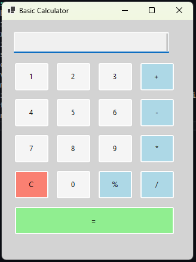

# Basic Calculator
A simple Windows Forms-based calculator application built with C# and .NET.
The calculator supports basic arithmetic operations and features a clean, user-friendly interface.

## Features
- Perform basic arithmetic operations:
	-  Addition (`+`)
	- Subtraction (`-`)
	- Multiplication(`*`)
	- Division (`/`)
	- Prosent (`%`)
- Responsive and visually appealing UI with:
	- Dynamic button layout.
	- Higlighted function buttons for better visibility.
- Clear button (`C`) to reset the calculation.
- Error handling for invalid inputs (ex: division by zero).

---

## Screenshot

---

### Prerequisites
- [Visual Studio](https://visualstudio.microsoft.com/) with Windows Forms App template installed.
- .NET Framework 4.7.2 or later / .NET Core (depending on your project setup).

---

### Installation

1. Clone repository : **https://github.com/bax082024/Calculator.git**
2. Open solution (`.sln`) file in Visual Studio.
3. Build the project to restore dependencies.
4. Run the app.

---

## Contact

Email : **bax082024@gmail.com**